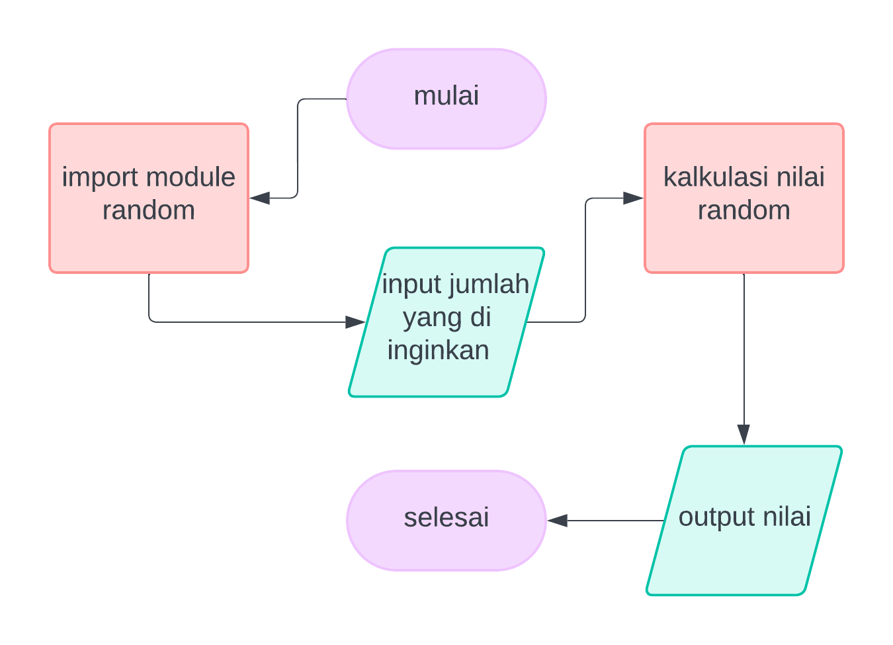
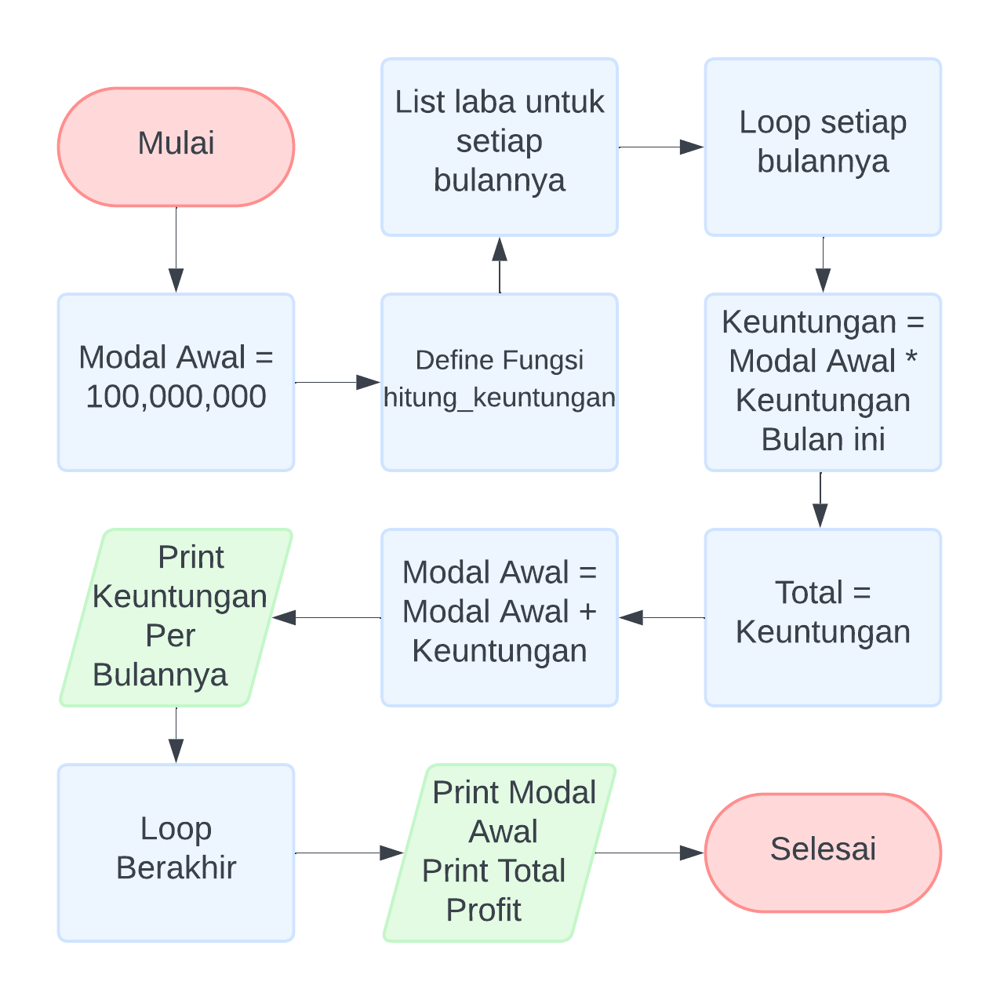
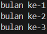
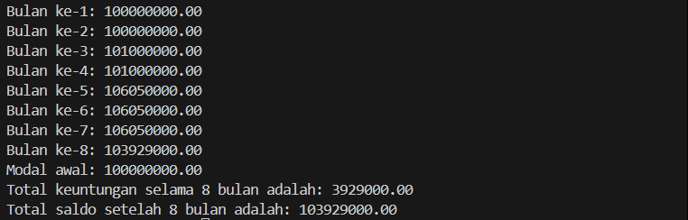
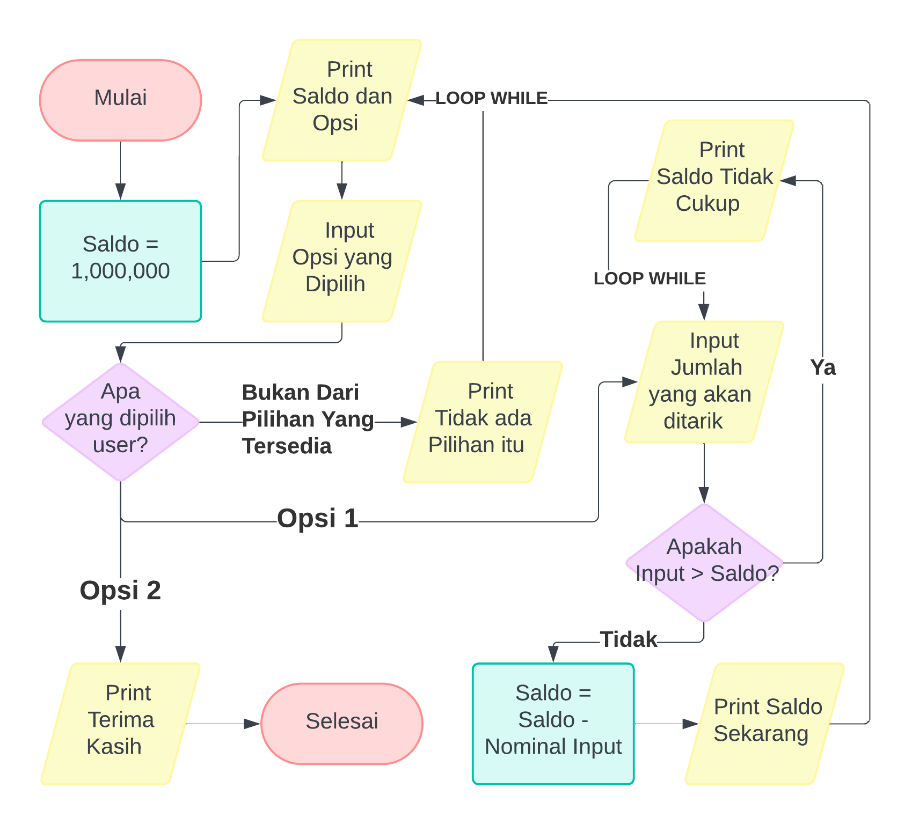
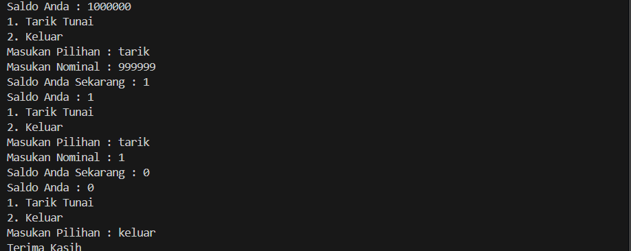

# Labpy03

Selamat Datang di Labpy

# Latihan 1

Soal:
```
1. Tampilkan n bilangan acak yang lebih kecil dari 0.5.
2. nilai n diisi pada saat runtime
3. anda bisa menggunakan kombinasi while dan for untuk menyelesaikannya
4. gunakan fungsi random() yang dapat diimport terlebih dahulu
```

## Flowchart



## Struktur [Program](program/latihan1.py)


```ruby
Import random
``` 
Mengimpor modul random untuk menghasilkan bilangan acak.


```ruby
while True
```
Dipakai untuk mengulang kembali permintaan input jika user tidak memasukan integer/angka atau ketika bilangan itu bernilai 0.


```ruby
jumlah
```
Variable jumlah ini akan menyimpan input user yang akan menjadi perulangan.


```ruby
try-except
```
Blok ini di tambahkan karna program tidak bisa memproses karakter, dengan blok ```try-except``` Program bisa mengantisipasi error ketika memproses input user ke variable ```jumlah```.


```ruby
random.uniform(0, 0.5)
```
Fungsi ini akan menghasilkan bilangan acak yang bernilai dibawah 0.5.


```ruby
for
```
For ini digunakan untuk memberikan data sebanding dengan nilai yang ada di variable ```jumlah```, kemudian print hasil perhitungan sesuai jumlah yang diminta.

Yang akan terjadi jika program dijalankan:


# Latihan 2

Soal:
```
Seorang pengusaha menginvestasikan uangnya untuk memulai usahanya dengan modal
awal 100 juta, pada bulan pertama dan kedua belum mendapatkan laba. pada bulan ketiga
baru mulai mendapatkan laba sebesar 1% dan pada bulan ke 5, pendapatan meningkat 5%,
selanjutnya pada bulan ke 8 mengalami penurunan keuntungan sebesar 2%, sehingga laba
menjadi 3%. Hitung total keuntungan selama 8 bulan berjalan usahanya.
```

## Flowchart



## Struktur [Program](program/latihan2.py)

```ruby
modal_awal
```
Variable yang menjadi patokan untuk perhitungan laba.


```ruby
laba = [0, 0, 0.01, 0, 0.05, 0, 0, -0.02]
```
variable yang mencerminkan keuntungan dan kerugian yang didapat,
```0``` bukanlah rugi. 


```ruby
for i, persentase in enumerate(laba, start=1)
```
```enumerate``` digunakan untuk memperbarui modal untuk setiap bulannya.
contohnya



```ruby
keuntungan = modal_awal * persentase
total += keuntungan
modal_awal += keuntungan
```
Disini laba akan dihitung, ```modal awal``` akan dikalikan dengan ```presentase laba``` nanti hasilnya akan menggantikan nilai variable ```modal awal```.

```ruby
print(f"Bulan ke-{i}: {modal_awal:.2f}")
print(f"Modal awal: {modal_awal:.2f}")
print(f"Total keuntungan selama 8 bulan adalah: {total:.2f}")
print(f"Total saldo setelah 8 bulan adalah: {modal_awal + total:.2f}")
```
Program akan menampilkan semua itu kepada user.

Yang akan terjadi:



# Latihan 3

Soal
```
Buat program yang mensimulasikan mesin ATM sederhana. Pengguna memiliki saldo awal
sebesar Rp 1.000.000, dan dapat menarik uang hingga saldo habis atau memilih untuk
keluar.
```

## Flowchart



## Struktur [Program](program/latihan3.py)

```ruby
saldo = 1000000
```
Ini adalah Variable yang berisi nilai dari uang yang ada.


```ruby
while True:
```
Perulangan ```While``` disini akan terus mengulang program.

```ruby
print(f"Saldo Anda : {saldo} \n1. Tarik Tunai\n2. Keluar")
```
Program akan menampilkan ```Saldo``` beserta pilihan Tarik Saldo dan Keluar.


```ruby
    if pilihan in ['1', 'tarik tunai', 'tarik']:
        nominal = int(input("Masukan Nominal : "))
        if nominal > saldo:
            print("Saldo Anda Tidak Cukup")
        else:
            saldo = saldo - nominal
            print(f"Saldo Anda Sekarang : {saldo}")
```
Ini adalah blok kode yang akan berjalan jika user memilih opsi Tarik Tunai, pertama akan meminta user untuk memberikan jumlah uang yang akan di tarik.
- Jika jumlahnya melebihi Saldo yang ada maka program akan menampilkan "Saldo tidak cukup"
- Jika ```Saldo``` cukup, maka program akan mengurangi ```saldo``` dengan saldo yang akan ditarik kemudian menampilkan ```saldo``` yang sudah diperbarui.


```ruby
    elif pilihan in ['2', 'keluar']:
        print("Terima Kasih")
        break
```
Ini akan berjalan jika user memilih opsi Keluar.

Yang akan:


