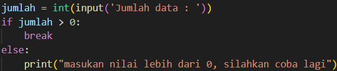
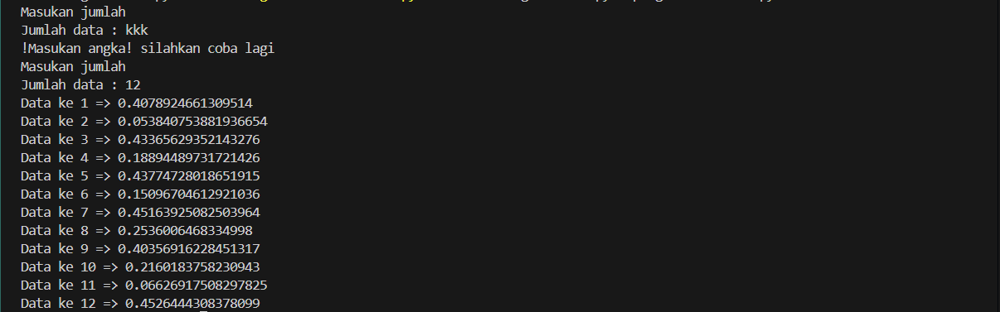

# Labpy03

# Latihan 1
```
1. Tampilkan n bilangan acak yang lebih kecil dari 0.5.
2. nilai n diisi pada saat runtime
3. anda bisa menggunakan kombinasi while dan for untuk menyelesaikannya
4. gunakan fungsi random() yang dapat diimport terlebih dahulu
```

## Penjelasan [Program](program/latihan1.py)

```ruby
Import random
``` 
Mengimpor modul random untuk menghasilkan bilangan acak.

```ruby
while True
```
Dipakai untuk mengulang kembali permintaan input jika user tidak memasukan integer/angka atau ketika bilangan itu bernilai 0.


```ruby
jumlah
```
Variable jumlah ini akan menyimpan input user yang akan menjadi perulangan.

```ruby
try-except
```
Blok ini di tambahkan karna program tidak bisa memproses karakter, dengan blok try-except saya bisa mengantisipasi error ketika program memproses input user ke variable ```jumlah```.

```ruby
random.uniform(0, 0.5)
```
Fungsi ini akan menghasilkan bilangan acak yang bernilai dibawah 0.5.

```ruby
for
```
For ini digunakan untuk memberikan data sebanding dengan nilai yang ada di variable ```jumlah```, itulah mengapa variable ```jumlah``` harus integer/angka.

Yang akan terjadi jika program dijalankan:


# Latihan 2

```
Seorang pengusaha menginvestasikan uangnya untuk memulai usahanya dengan modal
awal 100 juta, pada bulan pertama dan kedua belum mendapatkan laba. pada bulan ketiga
baru mulai mendapatkan laba sebesar 1% dan pada bulan ke 5, pendapatan meningkat 5%,
selanjutnya pada bulan ke 8 mengalami penurunan keuntungan sebesar 2%, sehingga laba
menjadi 3%. Hitung total keuntungan selama 8 bulan berjalan usahanya.
```

## Penjelasan [Program](program/latihan2.py)

```ruby
modal_awal
```
Variable yang menjadi patokan untuk perhitungan kita.

```ruby
def hitung_keuntungan()
```
Fungsi yang akan menampung perhitungan kita.

```ruby
laba = [0, 0, 0.01, 0, 0.05, 0, 0, -0.02]
```
variable yang mencerminkan keuntungan yang didapat

```ruby

```
```ruby

```
```ruby

```
```ruby

```
```ruby

```
```ruby

```
```ruby

```
